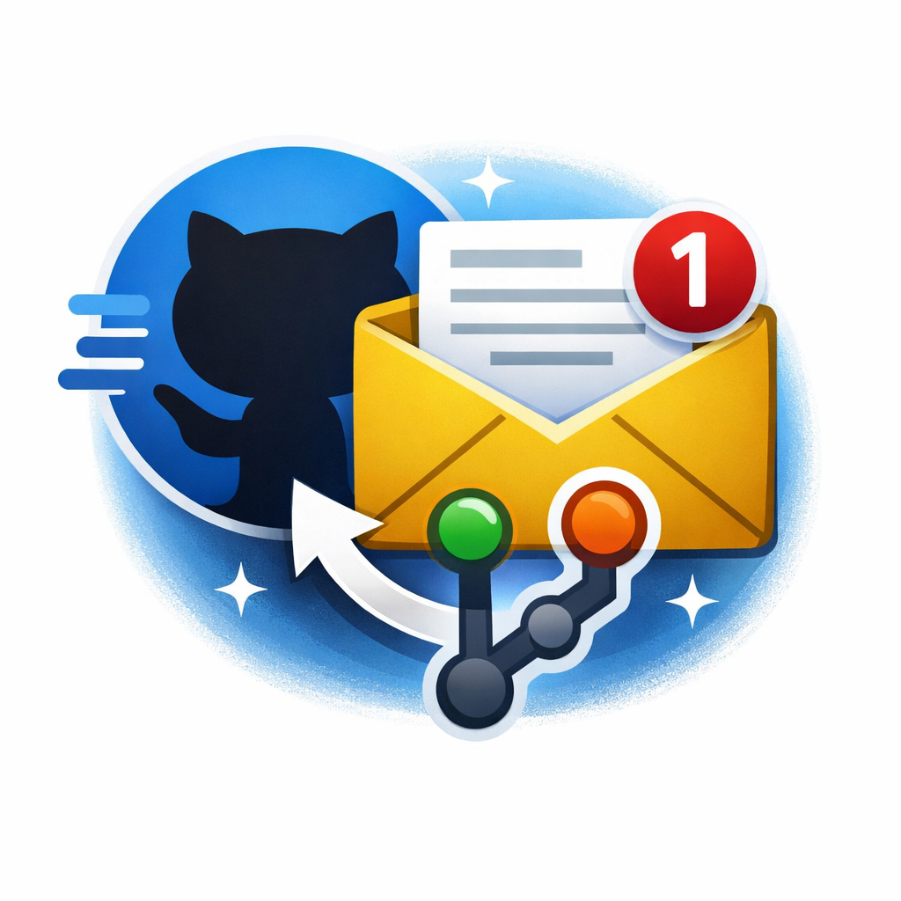

# Git Mail Workflow

This project demonstrates how to build a CI/CD notification system using GitHub Actions that automatically sends an email when a Pull Request is merged into the `main` branch.

The email notification is sent using the Brevo Email API.

---

## Overview

In modern development workflows, teams often need to be informed when important repository events occur. Instead of checking the repository manually, an automated workflow can send notifications as soon as something important happens.

Some common scenarios include:

* A developer completes a feature and merges it into the main branch
* A bug fix is merged
* A deployment pipeline finishes
* A release branch is merged

This project shows how to build a simple automated email notification system for such events.

---

## How the Workflow Works

The automation is triggered when a Pull Request is merged into the `main` branch.

Workflow:

Developer creates a branch
→ Developer opens a Pull Request
→ Pull Request is reviewed and merged into `main`
→ GitHub Actions workflow runs
→ Brevo API sends an email notification

The email contains useful information such as:

* Repository name
* Pull request title
* Link to the pull request
* Author who merged the change

---

## Technologies Used

* GitHub Actions for CI/CD automation
* Brevo Email API for sending transactional emails
* Curl for making API requests from the workflow

---

## Prerequisites

Before using this workflow, the following setup is required.

### 1. Brevo Account

Create an account on Brevo and generate an API key.

Steps:

1. Log in to the Brevo dashboard
2. Navigate to SMTP & API
3. Generate a new API key

This API key will be used by the workflow to send emails.

---

### 2. Verified Sender Email

Brevo requires that the sender email address is verified before sending emails.

Examples of sender addresses:

[git@yourdomain.com](mailto:git@yourdomain.com)
[notifications@yourdomain.com](mailto:notifications@yourdomain.com)

Unverified sender addresses will be rejected by Brevo.

---

### 3. GitHub Repository Secrets

Sensitive information should be stored as repository secrets.

In your repository go to:

Settings → Secrets → Actions

Add the following secrets:

BREVO_API_KEY = your Brevo API key
FROM_EMAIL = verified sender email address
TO_EMAIL = email address that will receive notifications

These values are securely accessed by the workflow during execution.

---

## Workflow File

The workflow configuration file is located at:

.github/workflows/email-notification.yml

This workflow is configured to trigger when:

* A Pull Request is merged into the `main` branch
* The workflow is manually triggered for testing

---

## Testing the Workflow

### Method 1: Real Pull Request Test

1. Create a new branch
2. Make a small change
3. Create a Pull Request
4. Merge the Pull Request into `main`

Once merged, the workflow will automatically run and send the email.

---

### Method 2: Manual Workflow Execution

To test the workflow without creating a Pull Request:

Repository → Actions → Email on PR Merge → Run Workflow

This allows quick testing of the email notification pipeline.

---

## Customizing the Workflow for Different Use Cases

This workflow can be adapted for various development and deployment scenarios.

### Feature Completion Notifications

When a developer merges a feature branch into `main`, an email can notify the team that a feature has been completed.

Example:

feature/login-system → main

Notification:
"Login system feature has been merged."

---

### Deployment Notifications

The workflow can be extended to run after a deployment pipeline.

Example pipeline:

Build → Test → Deploy → Send Email

This allows DevOps teams to notify stakeholders after successful deployments.

---

### QA Testing Notifications

When code is merged into a `staging` branch, the workflow can notify the QA team that a new build is ready for testing.

Example:

feature/payment → staging

Notification:
"New build available for QA testing."

---

### Release Notifications

When a release branch is merged, the workflow can notify product teams or stakeholders.

Example:

release/v2.0 → main

Notification:
"Version 2.0 has been released."

---

## Example Email Notification

Subject:

PR merged to main

Email body example:

Pull Request merged

Repository: git-mail-workflow
Pull Request: Revise README for Git Mail Workflow project
Link: https://github.com/your-repo/pull/2

---

## Conclusion

This project demonstrates how GitHub Actions can be used to automate notifications for repository events. By integrating GitHub Actions with the Brevo Email API, teams can create flexible notification systems that improve visibility and collaboration across development workflows.
